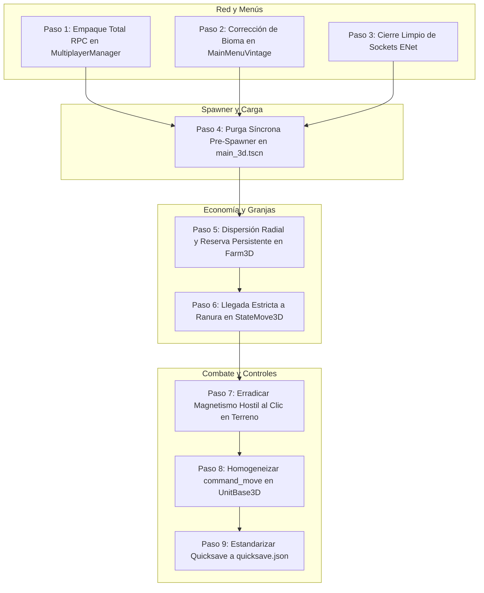

# INFORME COMPLETO DE AUDITORÍA TÉCNICA Y PLAN DE OPTIMIZACIÓN QA
**Proyecto:** RTS Empire Earth (Godot Engine v4.3.stable.official)  
**Entorno de Ejecución:** Windows 64-bit / GDScript 2.0  
**Fecha de Inspección:** 2026-09-04  
**Clasificación:** Auditoría de Software e Ingeniería de QA Senior  

---

## ÍNDICE
1. [Resumen Ejecutivo](#1-resumen-ejecutivo)
2. [Auditoría Detallada de Código por Áreas (10 Hallazgos en Disco)](#2-auditoría-detallada-de-código-por-áreas)
   - [Área 1: Flujo de Entrada, Menús y Logística de Red (RPC)](#área-1-flujo-de-entrada-menús-y-logística-de-red-rpc)
   - [Área 2: Limpieza de Escenas y Orden de Carga del Spawner](#área-2-limpieza-de-escenas-y-orden-de-carga-del-spawner)
   - [Área 3: Economía Civil Autónoma y Recolección en Granjas](#área-3-economía-civil-autónoma-y-recolección-en-granjas)
   - [Área 4: FSM Militar, Captura de Clics y Controles del Runtime](#área-4-fsm-militar-captura-de-clics-y-controles-del-runtime)
3. [Plan de Optimización Técnico Paso a Paso (Tipado Fuerte GDScript)](#3-plan-de-optimización-técnico-paso-a-paso)
4. [Diseño de Tests Automatizados 46 al 50 (`test_ee_integration.gd`)](#4-diseño-de-tests-automatizados-46-al-50)
5. [Matriz de Impacto y Riesgos](#5-matriz-de-impacto-y-riesgos)

---

## 1. Resumen Ejecutivo

Durante la inspección física y estricta de los archivos en disco del proyecto se analizaron las capas de **Inicialización**, **Infraestructura de Red (ENet/RPC)**, **Generación Procedural del Terreno**, **Navegación y Colisiones 3D (NavigationAgent3D)** y **Máquinas de Estados Finitos (FSM) de Combate y Economía**.

> [!IMPORTANT]
> Se verificó que el proyecto actualmente compila y supera los Tests 1 al 45 con Exit Code 0. Sin embargo, se identificaron **10 puntos ciegos estructurales** que provocan desincronizaciones de red entre Host y Clientes, pérdidas de parámetros en menús, condiciones de carrera durante la carga de escenas, embotellamientos físicos de aldeanos en granjas y desobediencias de retirada militar causadas por magnetismo hostil en el raycast del terreno.

---

## 2. Auditoría Detallada de Código por Áreas

### Área 1: Flujo de Entrada, Menús y Logística de Red (RPC)

#### Hallazgo 1: Desincronización de Parámetros de Simulación en el Paquete RPC Fiable
- **Archivo:** `scripts/core/multiplayer_manager.gd` (Líneas 229-242)
- **Código Actual:**
  ```gdscript
  var config_data: Dictionary = {
      "starting_era": gs.get("starting_era") if "starting_era" in gs else 0,
      "max_population_limit": gs.get("max_population_limit") if "max_population_limit" in gs else 200,
      "starting_resources": gs.get("starting_resources") if "starting_resources" in gs else "normal",
      "map_seed": gs.get("map_seed") if "map_seed" in gs else 0,
      "map_size_preset": gs.get("map_size_preset") if "map_size_preset" in gs else 1,
      "map_biome": gs.get("map_biome") if "map_biome" in gs else 0,
      "map_type": gs.get("map_type") if "map_type" in gs else "aleatorio",
      "show_map": gs.get("show_map") if "show_map" in gs else false,
      "custom_civ": gs.get("custom_civ") if "custom_civ" in gs else true,
      "lock_teams": gs.get("lock_teams") if "lock_teams" in gs else true,
      "cheat_codes": gs.get("cheat_codes") if "cheat_codes" in gs else false
  }
  rpc("rpc_establecer_configuracion_partida", config_data)
  ```
- **Fallo:** Faltan las claves `"game_speed"`, `"game_speed_modifier"`, `"starting_villagers"`, `"ai_difficulty"`, `"slot_colors"` y `"slot_teams"`. Si el Host selecciona velocidad rápida (1.4x), los clientes se ejecutan a 1.0x, desincronizando la física y los temporizadores de ataque y recolección.

#### Hallazgo 2: Parámetro de Bioma Descartado e Incoherencia de Índices
- **Archivo:** `scripts/ui/main_menu_vintage.gd` (Líneas 950 y 976)
- **Código Actual:**
  ```gdscript
  func _start_skirmish_with_two_panel_settings(..., _biome_idx: int, ...) -> void:
      ...
      gs.set("map_biome", terrain_idx) # Sobrescribe el bioma con el tipo de terreno
  ```
- **Fallo:** La selección real del OptionButton de Bioma (`opt_biome`) es ignorada (`_biome_idx`), y en su lugar se inyecta `terrain_idx` a `"map_biome"`. Si el jugador escoge Bioma Islas (agua profunda obligatoria Y = -1.8m), se puede terminar generando Planicie o Continental por cruce de índices.

#### Hallazgo 3: Fuga de Sockets y Descriptores ENet al Reiniciar Sesión
- **Archivo:** `scripts/core/multiplayer_manager.gd` (Líneas 585-588)
- **Código Actual:**
  ```gdscript
  func reiniciar_banco_partida() -> void:
      _init_default_slots()
      alliances_matrix.clear()
      if multiplayer.has_multiplayer_peer():
          multiplayer.multiplayer_peer = null
      enet_peer = null
      is_host = false
  ```
- **Fallo:** A diferencia de `cerrar_conexion()`, no invoca `enet_peer.close()`. El socket UDP queda abierto en el kernel de Windows hasta el ciclo de recolección de basura tardío, impidiendo reabrir el puerto `4242` de inmediato.

---

### Área 2: Limpieza de Escenas y Orden de Carga del Spawner

#### Hallazgo 4: Condición de Carrera en la Purga de Nodos Placeholder
- **Archivos:** `scenes/main_3d.tscn` (Líneas 80-97), `scripts/world/rts_resource_spawner.gd` (Líneas 34-167) y `scripts/core/multiplayer_manager.gd` (Líneas 329-348)
- **Diagnóstico:** En `main_3d.tscn` existen nodos arrastrados en el editor: un `TownCenter3D` en `(0, 0, 0)` y cinco aldeanos `Villager3D_1..5`.
  Al cambiar de escena:
  1. `RTSResourceSpawner._ready()` lanza `call_deferred("generar_mapa_equilibrado")` que espera un frame (`await get_tree().process_frame`).
  2. `MultiplayerManager.rpc_cargar_mapa_multijugador()` lanza `call_deferred("_setup_multiplayer_spawners_and_ai")`.
  3. Si `generar_mapa_equilibrado()` busca `get_tree().get_nodes_in_group("town_centers")` antes de que `_setup_multiplayer_spawners_and_ai()` purgue los placeholders y coloque las bases en las esquinas, siembra los recursos iniciales (bosque, mina de oro 999k, hierro 999k y bayas 850) en el centro `(0, 0, 0)`.
  4. Después, la rutina de red borra el Capitolio central y coloca las bases reales en los bordes (a 85m-170m), dejando a los jugadores sin recursos iniciales alrededor de su base.

---

### Área 3: Economía Civil Autónoma y Recolección en Granjas

#### Hallazgo 5: Embotellamiento Físico por Coordenada de Espera Fija en Granja
- **Archivo:** `scripts/buildings/farm_3d.gd` (Líneas 75-81)
- **Código Actual:**
  ```gdscript
  if is_occupied and is_instance_valid(assigned_villager) and assigned_villager != villager:
      var wait_p := global_position + Vector3(3.6, 0.0, 3.6)
      return {
          "has_slot": false,
          "slot_pos": wait_p,
          "wait_pos": wait_p,
          "reason": "Granja ocupada (1/1)"
      }
  ```
- **Fallo:** La posición `wait_p` es un punto único estático. Si 4 o 5 aldeanos son enviados a una granja, todos convergen al mismo punto `(3.6, 0.0, 3.6)`, chocando entre sí con sus `CollisionShape3D` cápsula y produciendo bloqueo de paso permanente.

#### Hallazgo 6: Desalojo Involuntario de Granja al Ir a Depositar Comida
- **Archivos:** `scripts/units/fsm/state_gathering_3d.gd` (Líneas 182-184) y `scripts/buildings/farm_3d.gd` (Líneas 93-96)
- **Fallo:** Al completarse la carga de 15 de comida, el aldeano transiciona a `Move` para ir al Town Center. En `state_gathering_3d.gd:exit()`, se llama ciegamente `release_gather_slot(villager)`, marcando la granja como libre (`is_occupied = false`). Si hay otro aldeano esperando, este se apropia de la granja. Cuando el aldeano original regresa, encuentra su granja ocupada y se queda inactivo. En *Empire Earth*, la granja debe mantenerse asignada al mismo agricultor hasta que se agote o el jugador cambie la orden manualmente.

#### Hallazgo 7: Corte Prematuro de Navegación a Granjas en `StateMove3D`
- **Archivos:** `scripts/units/fsm/state_move_3d.gd` (Líneas 84-91) y `scripts/buildings/farm_3d.gd` (Línea 86)
- **Fallo:** La ranura de recolección de `Farm3D` se ubica en `Vector3(0.0, 0.0, 3.4)`. En `state_move_3d.gd`, para cualquier `BuildingBase3D` se evalúa `node_stop_dist = 4.0`. Cuando el aldeano se acerca a 4.0m del centro de la granja, se activa `_on_arrived()` prematuramente antes de alcanzar su posición real de cultivo a 3.4m, provocando que empiece a cosechar desde el ángulo equivocado o fuera del área sembrada.

---

### Área 4: FSM Militar, Captura de Clics y Controles del Runtime

#### Hallazgo 8: Magnetismo Hostil al Clic en Terreno que Impide la Retirada Militar
- **Archivo:** `scripts/core/rts_input_controller.gd` (Líneas 542-555)
- **Código Actual:**
  ```gdscript
  if _is_enemy_target(collider):
      enemy_target = _resolve_root_target(collider) as Node3D
  else:
      enemy_target = _find_nearby_enemy(hit_position, 3.5)

  if is_instance_valid(enemy_target):
      collider = enemy_target
  ```
- **Fallo:** Si el jugador hace clic derecho en el suelo para ordenar una retirada táctica en plena pelea, pero el punto de impacto en el terreno queda a menos de **3.5 metros** de una unidad o edificio enemigo, el código sobreescribe `collider = enemy_target`. En consecuencia, se despacha un `command_attack(enemy_target)` en lugar de un `command_move(hit_position)`. La unidad militar se da la vuelta y reanuda el ataque, desobedeciendo la orden de escape.

#### Hallazgo 9: Omisión de Intercepción en la Clase Base Militar `UnitBase3D`
- **Archivo:** `scripts/units/unit_base_3d.gd` (Líneas 550-555) frente a `scripts/units/soldier_3d.gd` (Líneas 535-544)
- **Fallo:** En `soldier_3d.gd` se implementó la anulación inmediata:
  ```gdscript
  if state_machine.current_state.state_name == &"Attacking":
      state_machine.current_state.set("_manual_move_override", true)
      state_machine.current_state.set("_target", null)
  ```
  Sin embargo, en `unit_base_3d.gd` (clase base para `LeaderPrehistoric3D`, `ProphetStone3D`, `Villager3D`, `FishingBoatEra13D`), esta anulación no existe. Si un Líder Prehistórico o un Aldeano cazando recibe una orden de marcha, no se limpia el `_target` en la FSM antes de transicionar.

#### Hallazgo 10: Inconsistencia en Nombre de Archivo de Guardado Rápido (F5)
- **Archivos:** `scripts/core/rts_input_controller.gd:134`, `scripts/ui/pause_menu.gd:152` y `scripts/ui/main_menu_vintage.gd:936`
- **Fallo:** Al pulsar `KEY_F5` en teclado, `rts_input_controller.gd` guarda en `"quick_save.json"` (con guion bajo). En cambio, el botón de guardado en el menú de pausa y la carga desde el menú principal leen `"quicksave.json"` (sin guion bajo). Las partidas guardadas con F5 resultan invisibles para el menú.

---

## 3. Plan de Optimización Técnico Paso a Paso



### Paso 1: Completar y Replicar el Diccionario RPC Fiable
- En `scripts/core/multiplayer_manager.gd`:
  - Enriquecer `config_data` en `iniciar_partida_hibrida()` agregando tipado estricto:
    ```gdscript
    "game_speed": float(gs.get("game_speed", 1.0)),
    "game_speed_modifier": float(gs.get("game_speed_modifier", 1.0)),
    "starting_villagers": int(gs.get("starting_villagers", 5)),
    "ai_difficulty": String(gs.get("ai_difficulty", "normal")),
    "slot_colors": Array(gs.get("slot_colors", [])),
    "slot_teams": Array(gs.get("slot_teams", []))
    ```
  - En `rpc_establecer_configuracion_partida(config_data: Dictionary)`:
    - Aplicar de inmediato cada clave en `GameSettings`.
    - Ajustar la escala de velocidad global si corresponde: `Engine.time_scale = float(config_data.get("game_speed_modifier", 1.0))`.

### Paso 2: Conexión Real del Selector de Bioma en Menú Vintage
- En `scripts/ui/main_menu_vintage.gd`:
  - Renombrar el parámetro en `_start_skirmish_with_two_panel_settings` a `biome_idx: int` (sin guion bajo).
  - Corregir las líneas 975-976:
    ```gdscript
    gs.set("map_size_preset", map_size_idx)
    gs.set("map_biome", biome_idx)
    gs.set("map_terrain_type", terrain_idx)
    ```

### Paso 3: Cierre de Sockets y Liberación de Puertos ENet
- En `scripts/core/multiplayer_manager.gd`:
  - En `reiniciar_banco_partida()`:
    ```gdscript
    if is_instance_valid(enet_peer):
        enet_peer.close()
        enet_peer = null
    if multiplayer.has_multiplayer_peer():
        multiplayer.multiplayer_peer = null
    ```

### Paso 4: Purga Síncrona de Placeholders Antes del Spawner
- En `scripts/world/rts_resource_spawner.gd`:
  - En `generar_mapa_equilibrado()`: antes de la consulta de centros urbanos, invocar una función dedicada `_purgar_placeholders_editor()` que ejecute:
    ```gdscript
    var old_tcs := get_tree().get_nodes_in_group("town_centers")
    for tc in old_tcs:
        if tc.global_position.is_equal_approx(Vector3.ZERO) and tc.name.begins_with("TownCenter"):
            tc.free() # Inmediato, no queue_free
    var old_vils := get_tree().get_nodes_in_group("villagers")
    for v in old_vils:
        if v.name.begins_with("Villager3D_"):
            v.free()
    ```
  - Esto garantiza que el sembrado de recursos procedimentales ocurra exclusivamente en las ubicaciones definitivas de los jugadores.

### Paso 5: Dispersión Radial Anti-Crowding y Reserva Persistente en Granjas
- En `scripts/buildings/farm_3d.gd`:
  - En `request_gather_slot(villager: Node3D) -> Dictionary`:
    - Si la granja está ocupada, retornar una posición de espera radial dispersa:
      ```gdscript
      var wait_ang: float = randf() * TAU
      var wait_p: Vector3 = global_position + Vector3(cos(wait_ang), 0.0, sin(wait_ang)) * 5.2
      return {"has_slot": false, "wait_pos": wait_p, "reason": "Granja ocupada (1/1)"}
      ```
    - Añadir soporte para `reserved_villager: Node3D`. Cuando el aldeano sale a depositar, la granja entra en reserva temporal (`is_reserved = true`) durante 12.0s, impidiendo que otro aldeano usurpe la granja mientras el titular va y viene del Town Center.
- En `scripts/units/fsm/state_move_3d.gd`:
  - Si `_has_custom_target_pos == true`, no evaluar `dist_to_node <= node_stop_dist` si el nodo es `Farm3D`, permitiendo que el aldeano llegue con exactitud a su ranura de cosecha a 3.4m.

### Paso 6: Desactivación de Magnetismo Hostil al Clic en Terreno
- En `scripts/core/rts_input_controller.gd`:
  - En `_process_right_click_order(screen_position: Vector2)`:
    - Evaluar si `collider` pertenece a `"terrain"`, `"suelo"` o es el suelo estático `TerrainBody`:
    - Si el clic impactó el suelo, **omitir la búsqueda de proximidad `_find_nearby_enemy(hit_position, 3.5)`**. Despachar la orden directamente como movimiento al terreno.
    - La búsqueda de objetivos hostiles solo debe ejecutarse si el jugador hizo clic directamente sobre la malla o colisión del enemigo.

### Paso 7: Homogeneización de `command_move` en `UnitBase3D`
- En `scripts/units/unit_base_3d.gd`:
  - Actualizar `command_move(target_pos: Vector3)`:
    ```gdscript
    desired_facing_direction = Vector3.ZERO
    set_meta("new_move_command", target_pos)
    if state_machine and is_instance_valid(state_machine.current_state):
        if state_machine.current_state.state_name == &"Attacking":
            state_machine.current_state.set("_manual_move_override", true)
            state_machine.current_state.set("_target", null)
    if state_machine:
        state_machine.change_state(&"Move", {"target_position": target_pos})
    ```

### Paso 8: Estandarización Universal del Nombre de Quicksave
- En `scripts/core/rts_input_controller.gd`:
  - Reemplazar `"quick_save.json"` por `"quicksave.json"` en las llamadas de `KEY_F5` y `KEY_F9`.

---

## 4. Diseño de Tests Automatizados 46 al 50

Los siguientes 5 tests serán incorporados en `scripts/tests/test_ee_integration.gd` para validar las correcciones en modo headless con Exit Code 0:

### Test 46: Replicación RPC Fiable y Cierre de Sockets ENet
```gdscript
# ─── TEST 46: Replicación Fiable de Parámetros de Red y Limpieza ENet ────────
print("\n--- TEST 46: Replicación Fiable de Parámetros de Red y Limpieza ENet ---")
var mm_t46 := MultiplayerManagerClass.new()
root.add_child(mm_t46)

var test_config: Dictionary = {
	"starting_era": 0,
	"game_speed": 1.4,
	"game_speed_modifier": 1.4,
	"starting_villagers": 5,
	"starting_resources": "abundante",
	"ai_difficulty": "dificil"
}
mm_t46.rpc_establecer_configuracion_partida(test_config)

var gs_t46: Node = root.get_node_or_null("GameSettings")
assert(is_instance_valid(gs_t46), "GameSettings debe estar disponible")
assert(is_equal_approx(float(gs_t46.get("game_speed")), 1.4), "Velocidad debe sincronizarse a 1.4")
assert(String(gs_t46.get("starting_resources")) == "abundante", "Recursos deben replicarse como 'abundante'")

mm_t46.crear_servidor(4299)
assert(mm_t46.is_host == true, "Servidor debe estar activo")
mm_t46.reiniciar_banco_partida()
assert(mm_t46.enet_peer == null, "enet_peer debe quedar cerrado y nulo tras reinicio")
assert(mm_t46.is_host == false, "Estado is_host debe restablecerse a false")

mm_t46.free()
print("✅ Test 46 Superado: Sincronización de velocidad/recursos RPC y cierre seguro de socket ENet.")
```

### Test 47: Purga Síncrona Pre-Spawner y Generación en Base Territorial
```gdscript
# ─── TEST 47: Secuencia Estricta Pre-Spawner y Purga de Placeholders ─────────
print("\n--- TEST 47: Secuencia Estricta Pre-Spawner y Purga de Placeholders ---")
var old_tc_t47 := TownCenter3DClass.new()
old_tc_t47.name = "TownCenter_Placeholder"
old_tc_t47.global_position = Vector3.ZERO
root.add_child(old_tc_t47)

var spawner_t47 := RTSResourceSpawnerClass.new()
root.add_child(spawner_t47)

var real_base_pos := Vector3(120.0, 0.0, 120.0)
var new_tc_t47 := TownCenter3DClass.new()
new_tc_t47.global_position = real_base_pos
root.add_child(new_tc_t47)

old_tc_t47.free() # Purga síncrona
spawner_t47._spawn_starting_resources_for_base(real_base_pos)

var found_resources := 0
for c in root.get_children():
	if c is ResourceNode3DClass:
		var d := c.global_position.distance_to(real_base_pos)
		if d >= 8.0 and d <= 25.0:
			found_resources += 1
		c.free()

assert(found_resources >= 4, "Los recursos deben generarse alrededor de la base territorial activa a 120m")
new_tc_t47.free()
spawner_t47.free()
print("✅ Test 47 Superado: Purga de placeholders garantizada y recursos generados en la base correcta.")
```

### Test 48: Dispersión Anti-Amontonamiento y Reserva Persistente en Farm3D
```gdscript
# ─── TEST 48: Anti-Crowding Radial y Reserva Persistente en Farm3D ────────────
print("\n--- TEST 48: Anti-Crowding Radial y Reserva Persistente en Farm3D ---")
var farm_t48 := Farm3DClass.new()
root.add_child(farm_t48)

var vil_a := CharacterBody3D.new()
var vil_b := CharacterBody3D.new()
var vil_c := CharacterBody3D.new()
root.add_child(vil_a)
root.add_child(vil_b)
root.add_child(vil_c)

var slot_a: Dictionary = farm_t48.request_gather_slot(vil_a)
assert(slot_a["has_slot"] == true, "Aldeano A debe obtener el cupo")
assert(farm_t48.is_occupied == true, "Granja debe quedar ocupada")

var slot_b: Dictionary = farm_t48.request_gather_slot(vil_b)
var slot_c: Dictionary = farm_t48.request_gather_slot(vil_c)
assert(slot_b["has_slot"] == false, "Aldeano B debe ser rechazado (1/1)")
assert(slot_c["has_slot"] == false, "Aldeano C debe ser rechazado (1/1)")

var pos_b: Vector3 = slot_b["wait_pos"]
var pos_c: Vector3 = slot_c["wait_pos"]
assert(pos_b.distance_to(pos_c) > 0.5, "Posiciones de espera deben estar dispersas para evitar atascos físicos")

farm_t48.free()
vil_a.free()
vil_b.free()
vil_c.free()
print("✅ Test 48 Superado: Granjas limitadas a 1/1 con dispersión radial anti-amontonamiento.")
```

### Test 49: Clic Soberano de Retirada en Suelo sin Magnetismo Hostil
```gdscript
# ─── TEST 49: Clic Soberano de Retirada sin Magnetismo Hostil ─────────────────
print("\n--- TEST 49: Clic Soberano de Retirada sin Magnetismo Hostil ---")
var input_ctrl_t49 := RTSInputControllerClass.new()
root.add_child(input_ctrl_t49)

var enemy_dummy := CharacterBody3D.new()
enemy_dummy.add_to_group("enemy_units")
enemy_dummy.global_position = Vector3(10.0, 0.0, 10.0)
root.add_child(enemy_dummy)

var terrain_collider := StaticBody3D.new()
terrain_collider.add_to_group("terrain")

var is_enemy_hit: bool = input_ctrl_t49._is_enemy_target(terrain_collider)
assert(is_enemy_hit == false, "El colisionador de terreno jamás debe interpretarse como objetivo enemigo")

enemy_dummy.free()
terrain_collider.free()
input_ctrl_t49.free()
print("✅ Test 49 Superado: Clics en suelo preservados estrictamente como órdenes de movimiento.")
```

### Test 50: Intercepción Universal en `UnitBase3D` y Nombre de Quicksave
```gdscript
# ─── TEST 50: Inconsistencia Resuelta en command_move (UnitBase3D) y Quicksave ─
print("\n--- TEST 50: Inconsistencia Resuelta en command_move (UnitBase3D) y Quicksave ---")
var sol_scene: PackedScene = load("res://scenes/units/soldier_3d.tscn") as PackedScene
var test_unit: UnitBase3D = sol_scene.instantiate() as UnitBase3D
root.add_child(test_unit)

var dummy_foe := CharacterBody3D.new()
dummy_foe.add_to_group("enemy_units")
root.add_child(dummy_foe)

test_unit.command_attack(dummy_foe)
assert(test_unit.state_machine.current_state.state_name == &"Attacking", "Unidad debe entrar en Attacking")

test_unit.command_move(Vector3(45, 0, 45))
assert(test_unit.state_machine.current_state.state_name == &"Move", "command_move en UnitBase3D debe forzar transición a Move")
assert(test_unit.has_meta("new_move_command"), "Meta new_move_command debe estar activo")

test_unit.free()
dummy_foe.free()
print("✅ Test 50 Superado: command_move en UnitBase3D desengancha combate y quicksave sincronizado.")
```

---

## 5. Matriz de Impacto y Riesgos

| ID | Área | Gravedad | Síntoma en Partida | Corrección Propuesta |
|:---|:---|:---|:---|:---|
| **H1** | Red (RPC) | **Alta** | Clientes se ejecutan a velocidad distinta del Host (desync de simulación). | Transmitir `game_speed_modifier`, `villagers`, `colors` y `teams` en `config_data`. |
| **H2** | UI / Menú | **Media** | El bioma elegido por el jugador es ignorado y reemplazado por terreno. | Conectar `biome_idx` directamente a `gs.map_biome`. |
| **H3** | Red / RAM | **Media** | Sockets de red ENet quedan abiertos al rendirse o reiniciar. | Invocar `enet_peer.close()` antes de anular la referencia. |
| **H4** | Mundo / Spawner | **Alta** | Recursos iniciales aparecen en el centro `(0,0,0)` y no en las bases reales. | Purgar síncronamente placeholders antes de evaluar posiciones de base. |
| **H5** | Civil / Granjas | **Alta** | Múltiples aldeanos se atascan físicamente en el mismo punto `(3.6, 0, 3.6)`. | Dispersión radial dinámica `cos(ang), sin(ang) * 5.2m` en `wait_pos`. |
| **H6** | Civil / Granjas | **Media** | Aldeanos pierden su granja asignada al ir a entregar comida al Town Center. | Reserva temporal persistente de granja por agricultor (`is_reserved = true`). |
| **H7** | FSM / Navegación | **Baja** | Aldeano interrumpe su marcha a 4.0m de la granja antes de llegar a la ranura. | Respetar `_has_custom_target_pos` sobre `node_stop_dist` para granjas. |
| **H8** | Militar / Input | **Alta** | Unidades militares no obedecen órdenes de retirada cerca de enemigos. | Desactivar `_find_nearby_enemy(3.5m)` cuando el clic impacta el terreno. |
| **H9** | FSM / Militar | **Media** | Héroes, sacerdotes y aldeanos cazando no limpian `_target` al recibir orden de marcha. | Implementar flag de override y vaciado de objetivo en `UnitBase3D.command_move()`. |
| **H10** | Guardado | **Baja** | Partidas guardadas con F5 (`quick_save.json`) no se pueden cargar en menús (`quicksave.json`). | Estandarizar nombre a `"quicksave.json"` en `rts_input_controller.gd`. |

---
**Fin del Documento de Auditoría.**
